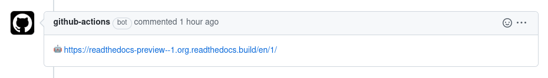

# Comment with links to Read the Docs preview

Comment on your Pull Requests with the links to the modified documentation pages on Read the Docs

## Example



## How to use it


First, enable "Preview Documentation from Pull Requests" in your Read the Docs project by following this guide
https://docs.readthedocs.io/en/latest/pull-requests.html


After that, create a [GitHub Action](https://docs.github.com/en/actions) in your repository with the following content:

```yaml
# .github/workflows/documentation-links.yaml

name: Read the Docs Pull Request Preview
on:
  pull_request_target:
    types:
      - opened
      - synchronize

permissions:
  pull-requests: write

jobs:
  documentation-links:
    runs-on: ubuntu-latest
    steps:
      - uses: readthedocs/readthedocs-preview@main
        with:
          project-slug: "readthedocs-preview"
```


Note that you have to replace `readthedocs-preview` with the `project-slug` for your own project.